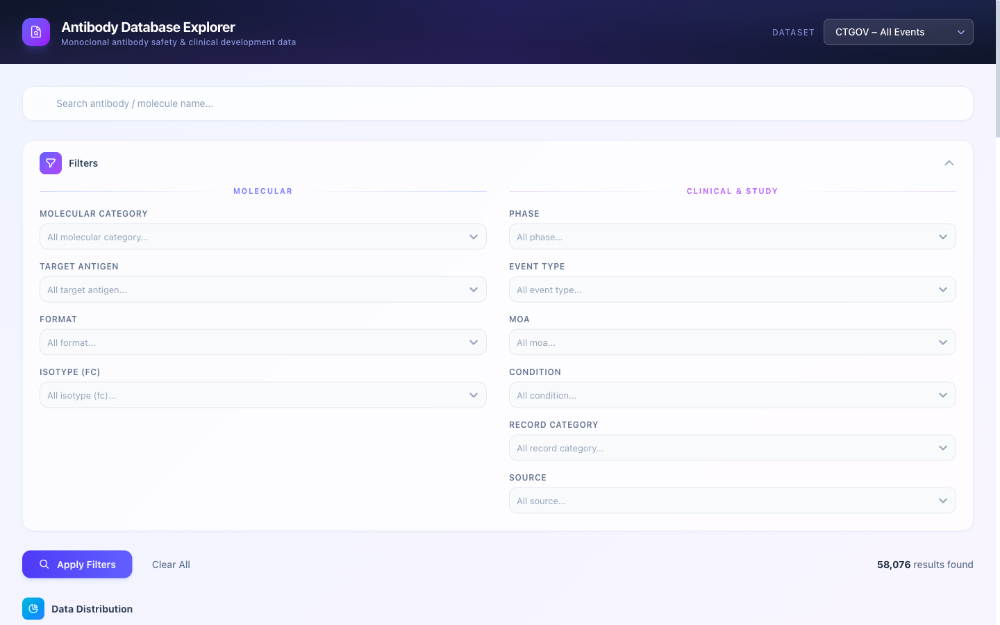

# Antibody Database Explorer

A web application for querying, filtering, and visualizing monoclonal antibody (mAb) safety and clinical development data.



## Features

- **Multi-dataset Support**: Query across 6 datasets (ClinicalTrials.gov & FDA Label)
- **Advanced Filtering**: 10+ filter criteria including target, MOA, condition, phase, etc.
- **Data Visualization**:
  - Distribution donut charts (molecular category, MOA, targets)
  - Adverse event bar charts (by organ system or AE term)
  - Comparative arm analysis (treatment vs. comparator)
- **Data Export**: CSV export with applied filters
- **Responsive UI**: Modern glassmorphism design with Tailwind CSS

## Tech Stack

| Layer | Technology |
|-------|------------|
| Frontend | React + Vite + Tailwind CSS |
| Charts | Plotly.js |
| Backend | Python FastAPI |
| Database | SQLite |

## Quick Start

### Prerequisites

- Python 3.9+
- Node.js 18+

### Installation

```bash
# Clone the repository
git clone https://github.com/Jiaaqiliu/Antibody-database.git
cd Antibody-database

# Install backend dependencies
pip install -r backend/requirements.txt

# Generate database from Excel
cd backend && python ingest.py && cd ..

# Install frontend dependencies
cd frontend && npm install && cd ..
```

### Run Development Server

```bash
# Terminal 1: Start backend
cd backend && uvicorn main:app --reload --port 8000

# Terminal 2: Start frontend
cd frontend && npm run dev
```

Open http://localhost:5173 in your browser.

## Project Structure

```
├── backend/
│   ├── main.py              # FastAPI application
│   ├── ingest.py            # Excel → SQLite converter
│   └── requirements.txt
├── frontend/
│   ├── src/
│   │   ├── components/      # React components
│   │   ├── context/         # State management
│   │   └── api.js           # API client
│   └── package.json
├── data/
│   └── Full_mab_datasets.xlsx
├── docs/
│   ├── functional_spec.md
│   └── screenshots/
└── render.yaml              # Deployment config
```

## API Endpoints

| Endpoint | Method | Description |
|----------|--------|-------------|
| `/api/tables` | GET | List all datasets |
| `/api/filter-options` | GET | Get filter dropdown values |
| `/api/query` | POST | Query data with filters |
| `/api/chart/distribution` | GET | Distribution chart data |
| `/api/chart/adverse-events` | POST | AE analysis data |
| `/api/chart/comparative` | POST | Arm comparison data |
| `/api/export` | GET | Export filtered data as CSV |

## Deployment

This project is configured for one-click deployment on [Render.com](https://render.com).

[](https://render.com/deploy)

See [docs/DEPLOY.md](docs/DEPLOY.md) for detailed instructions.

## Data Sources

- **ClinicalTrials.gov**: Clinical trial adverse event data
- **FDA Label**: Drug label safety information (BBW, WAP)

## License

MIT
